# 06 · Security, Policy, Authority, Evidence & Receipts

## 1 · Sicherheitsmodell

ToolFabric geht davon aus, dass **Modelloutput, Tooloutput, Dateien, Webseiten, Issues, PR-Kommentare, MCP-Responses und Research-Quellen potenziell feindliche Daten** enthalten. Sicherheit wird deshalb nicht durch Systemprompts allein erzwungen.

## 2 · Threat Classes

### T1 · Prompt / Instruction Injection

Untrusted Content versucht, neue Befehle oder Prioritäten zu setzen.  

**Mitigation:** Instruction Manifest, Precedence, retrieved-content=data, keine dynamische Policy aus Tooloutput.

### T2 · Capability Escalation

Agent fordert breitere Filesystem-/Shell-/Forge-Rechte als Task benötigt.  

**Mitigation:** deny-by-default, scoped Capability, max Risk, non-delegable defaults.

### T3 · Path / Workspace Escape

Traversal, Symlink, UNC, Alternate Data Stream, archive traversal, case/normalization tricks.  

**Mitigation:** canonical path resolution, workspace root binding, archive sanitizer, pre/post stat.

### T4 · Secret Exfiltration

Credentials landen in Prompt, Log, Receipt, Diff oder externem Request.  

**Mitigation:** reference-not-value, secret.scan/redact, egress policy, redacted error bodies, no raw env dump.

### T5 · Duplicate / Ambiguous Side Effects

Retry nach Timeout führt zu doppeltem Push, Post, Zahlung, Merge oder Write.  

**Mitigation:** Idempotency Key, expected revision, leases/fencing, intent-before-effect, `uncertain` state, reconciliation.

### T6 · TOCTOU / Revision Drift

Agent liest A, schreibt aber auf inzwischen verändertes B.  

**Mitigation:** expected digest/SHA/revision in mutierenden Calls; Konflikt statt blindem Überschreiben.

### T7 · Artifact Substitution

Geprüftes Artefakt wird zwischen Test und Release ersetzt.  

**Mitigation:** content-addressed artifacts, unchanged-bytes promotion, signed manifest.

### T8 · Provider Semantic Drift

Adapter/Provider behandelt Tool-Schema, Cancellation, Errors oder Context anders.  

**Mitigation:** provider conformance suite + versioned adapter + unsupported statt stiller Degradation.

### T9 · Compromised Worker

Worker versucht fremden Scope zu lesen/schreiben.  

**Mitigation:** Worktree/OS boundary + capabilities + broker, nicht nur Promptregeln.

### T10 · Review Collusion / False Independence

Implementer reviewed sich selbst oder Reviewer sieht nur geschönte Summary.  

**Mitigation:** unabhängige Worker-ID/Session, Diff Artifact direkt, Evidence refs, Review Receipt.

### T11 · Supply Chain / Dependency Mutation

Ungepinnte Pakete, Lockfile Drift, License/CVE-Risiken.  

**Mitigation:** package.resolve, checksum/lock verification, license.inspect, [vulnerability.search](http://vulnerability.search), SBOM hooks.

### T12 · Context Contamination

Alte Session-/Systemtexte oder semantische Retrievaltreffer werden falschem Task zugemischt.  

**Mitigation:** explicit session identity, protected roles, exact retrieval first, context manifest + diff.

### T13 · Network Pivot / Data Egress

Tool nutzt erlaubten Prozess, um unkontrolliert Netzwerkziele anzusprechen.  

**Mitigation:** OS-/containerseitige Network Policy wo möglich; `network.authorize` als zusätzliche Schranke. String-Blocklisten allein sind keine Sandbox.

### T14 · Claim Inflation

Ein technischer PASS wird als fachlicher Erfolg oder Produktreife dargestellt.  

**Mitigation:** Claim Classifier, Evidence Class, explizite Nicht-Claims und Completion Contract.

## 3 · Policy Decision Flow

```mermaid
flowchart LR
 C["Canonical Tool Call"] --> A["action.classify"]
 A --> P["policy.check"]
 P --> K["capability.resolve"]
 K --> N["network.authorize if needed"]
 N --> H["approval.request if risk trigger"]
 H --> I["intent receipt"]
 I --> X["execute in sandbox/scope"]
 X --> R["result + artifact digests"]
 R --> E["completion/failure receipt"]
 E --> G["gate.evaluate / claim.classify"]
```



## 4 · Intent / Completion Receipt

Vor jedem mutierenden Side Effect wird ein `*.intent` Receipt synchron durable geschrieben. Danach genau eines:

- `*.committed`
- `*.failed`
- `*.cancelled`
- offen geblieben → nach Restart `uncertain` bis Reconciliation

Intent enthält keine Secrets, aber Call ID, Tool, Scope, Args Digest, Expected State, Idempotency Key, Approval Ref und Fencing Token Digest.

## 5 · Receipt Hash Chain

Jeder **ToolFabric Execution Task** besitzt eine append-only Chain:

`previous_receipt_hash → canonical receipt bytes → receipt_hash`.

Periodische Roots können zusätzlich signiert/extern verankert werden. Eine Hashkette allein beweist Integrität relativ zum gespeicherten Root; Signatur/externes Timestamping erhöht die Provenienz, ist aber ein eigener Claim. **Im ARCHY-Betrieb ist diese Receipt-Chain Execution-Evidence und wird über work_order_id/action_id/revision refs in den Agentic Revision Graph eingebunden; sie ersetzt weder dessen Timeline noch dessen Branch/Merge/Revert-Semantik.**

## 6 · Evidence Classes

- **E0 · Assertion:** nur Modell-/Menschenbehauptung.
- **E1 · Static:** Code/Config/Manifest gelesen.
- **E2 · Executed:** konkreter Tool-/Test-/Buildlauf ausgeführt.
- **E3 · Reproduced:** wiederholter Lauf unter definierter Matrix.
- **E4 · Independently verified:** getrennte Instanz/Umgebung prüft definiertes Kriterium.
- **E5 · Signed/anchored:** Evidence zusätzlich kryptografisch an Identity/Root gebunden.

Ein höheres E-Level bedeutet nicht automatisch einen größeren fachlichen Scope.

## 7 · Claim Contract

```json
{
  "claim_id": "uuid",
  "statement": "All relevant unit tests pass on commit X",
  "type": "technical_integrity",
  "status": "supported",
  "scope": {"repo":"owner/name","commit":"sha"},
  "evidence_refs": ["receipt://..."],
  "non_claims": ["No production deployment was tested"]
}
```

## 8 · Secret Handling

**Regel:** Modelle sehen Secretwerte nur, wenn die konkrete Aktion technisch unmöglich anders ausführbar ist und R4 explizit genehmigt wurde. Standardpfad ist Secret Reference → Broker injiziert Wert in Prozess/API → Modell erhält nur Erfolg/Fehler + redigierte Metadaten.

Nie in Logs/Receipts:

- API keys
- cookies/session tokens
- passwords
- private keys
- full Authorization headers
- raw credential files

## 9 · Approval Contract

Approval ist ein signierter/gebundener Scope, kein Chatgefühl:

```json
{
  "approval_id":"uuid",
  "granted_for":["forge:merge"],
  "resource":"repo:owner/name#pr:7",
  "risk_ceiling":"R3",
  "valid_until":"...",
  "single_use":true,
  "granted_by":"human",
  "task_id":"uuid"
}
```

Bestehende explizite Userfreigabe wird wiederverwendet, solange Ressource, Risk und Scope passen. Unter ARCHY wird eine Approval-Anforderung – einschließlich MCP MRTR/input-required – als gebundenes ARCHY Event protokolliert; ToolFabric konsumiert anschließend nur den resultierenden Approval-Ref.

## 10 · Data Locality

Jeder Task/Artifact kann Label tragen:

- `public`
- `workspace_private`
- `local_only`
- `secret`
- `regulated`

`model.route` und `network.authorize` müssen diese Labels beachten. `local_only` darf nicht versehentlich an Cloud-Provider gelangen.

## 11 · Sandboxing

Referenzruntime unterstützt abgestuft:

1. isolierter Git Worktree
2. Prozess Job Object / restricted token / Unix namespace
3. Container
4. VM
5. Remote disposable worker

Welche Stufe tatsächlich aktiv ist, wird über `sandbox.boundary` **beobachtet und receipted**; keine „Sandbox“-Behauptung nur aufgrund eines Configflags.

## 12 · Audit Exports

`diagnostics/report` kann erzeugen:

- Task timeline
- Tool calls
- Policy decisions
- Approvals
- Receipt verification
- Artifact digests
- Execution revision/effect graph + ARCHY revision correlation refs
- open/uncertain intents
- redaction summary
- Provider adapter versions

Export ist read-only Projektion und enthält standardmäßig keine Raw Secrets/Raw large outputs. **Der globale Agentic Revision Graph bleibt in ARCHY; ToolFabric exportiert nur seinen Execution-/Evidence-Ausschnitt.**