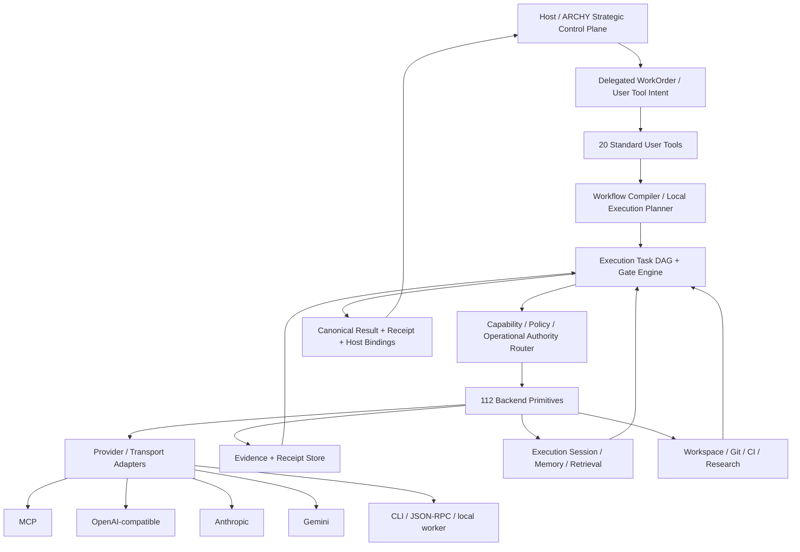

# resonArch ToolFabric · Master-Bauanleitung v0.1 · Provider-agnostische Agenten-Plugin-Suite

**Dokumenttyp:** normative Engineering-Bauanleitung · **Stand:** 07.10.2026 · **Status:** DESIGN / Implementierungsvertrag, noch keine produktive Freigabe.

<aside>
🧭

**Arbeitsname: resonArch ToolFabric.** Ziel ist eine provider-agnostische Agenten-Plugin-Suite, die nicht primär aus Prompt-Skills besteht, sondern aus **112 typisierten Backend-Primitives** mit ausführbaren Contracts und **20 menschenverständlichen Standard-User-Tools**, die diese Primitives sicher zu Workflows zusammensetzen. Leitmotiv: **Real tools. Agent-operated. Human-controlled. Every action leaves a receipt.**

</aside>

## 0 · Warum diese Suite existiert

Superpowers liefert wertvolle Entwicklungsrituale wie Brainstorming, TDD, Debugging, Worktrees, Review, Verifikation und Subagenten-Flows. ToolFabric übernimmt die nützliche Disziplin, verschiebt aber die entscheidenden Garantien eine Schicht tiefer: **ein Workflow-Text ist keine Sicherheits-, Authority- oder Evidence-Grenze.**

ToolFabric trennt deshalb strikt:

- **User Tool:** verständlicher Workflow wie `implement`, `debug`, `review` oder `release`.
- **Planner/Router:** kompiliert innerhalb eines delegierten Auftrags einen **lokalen Execution-DAG** und wählt zulässige Modelle/Provider/Worker nach Fähigkeiten. In ARCHY-Integration besitzt er weder den globalen WorkOrder-/Revision-Graph noch die strategische Projektplanung.
- **Backend Primitive:** kleinste ausführbare, schema-validierte Fähigkeit.
- **Policy/Capability Broker:** darf Rechte begrenzen, niemals ein Modell selbst.
- **Authority Layer:** entscheidet innerhalb des delegierten Capability-/Resource-Scopes, welche konkrete Operation welchen externen oder lokalen Zustand verändern darf. Globale Projekt-/Revision-/Branch-/Merge-/Revert-Authority verbleibt beim Host, in resonArch bei ARCHY.
- **Evidence Layer:** bindet Eingaben, Ausgaben, Diffs, Tests, Artefakte und Entscheidungen an Receipts.
- **Provider Adapter:** übersetzt denselben kanonischen Tool-Contract nach MCP, OpenAI, Anthropic, Gemini, CLI/JSON-RPC oder lokale Worker.

## 1 · Normative Herkunft

Diese Bauvorgabe ist aus den vorhandenen resonArch-Regeln abgeleitet, nicht aus einer abstrakten Agenten-Theorie.

**Verwandte Notion-Bauakten:** [resonArch ARCHY · Master-Bauanleitung v1.1 · Agentic Revision & Multi-Chat Control Plane](https://app.notion.com/p/resonArch-ARCHY-Master-Bauanleitung-v1-1-Agentic-Revision-Multi-Chat-Control-Plane-3ef77bf9a916818fb5dcdf6050c5dfaa?pvs=21); [03 · rA/D_Commander · Architektur, Sicherheits- und Logging-Vertrag v0.1](https://app.notion.com/p/03-rA-D_Commander-Architektur-Sicherheits-und-Logging-Vertrag-v0-1-3f077bf9a9168117a670d638e43297bd?pvs=21); [resonArch-Visual-State-Protocol · Master-Bauanleitung v0.1](https://app.notion.com/p/resonArch-Visual-State-Protocol-Master-Bauanleitung-v0-1-3f077bf9a91681909c5fd15c12ad24be?pvs=21); [resonArch Konzept- und Vertragsatlas · v0.3](https://app.notion.com/p/resonArch-Konzept-und-Vertragsatlas-v0-3-3e877bf9a91681108bdbc4a76b70af72?pvs=21).

**Primäre Repo-Regeln:** `rsgt-solver-sdk/AGENTS.md`, `genesis-delta-lambda/AGENTS.md`, `genesis-delta-lambda-n/AGENTS.md`, `genesis-delta-lambda-n-kindergarten/AGENTS.md`, `hecht.accounting/AGENTS.md`, `resonarch-ARCHY/src/agent.cjs`, `sentinel-agent/src/sentinel/llm/prompts.py`, `resonarch-context-gateway`, `resonArch.devFlow`, `nLM-Peer-Agent` und die gesichteten Provider-/Subagenten-Instruktionen.

## 2 · Nicht verhandelbare Invarianten

1. **Authority bleibt bereichsgebunden.** Ein Tool darf nur den Zustand verändern, dessen Authority-Scope es explizit besitzt.
2. **Modelle sind Planer/Operatoren, keine Wahrheitsauthority.** Tool-Output, Web-Inhalt, Dateien und MCP-Ergebnisse sind untrusted data.
3. **Kein Erfolgsclaim ohne ausgeführten Beleg.** Terminalausgabe allein ist kein Korrektheitsnachweis; relevante Tests/Gates und Artefakte werden gebunden.
4. **Fail closed bei unklarer Zuständigkeit, fehlender Beobachtbarkeit, Schemaabweichung, Rechtekonflikt oder nicht-idempotentem Retry.**
5. **Build once; promote unchanged bytes.** Geänderte Bytes sind ein neuer Kandidat.
6. **Append-only Evidence.** Korrekturen ergänzen Amendments; historische Belege werden nicht still überschrieben.
7. **Implemented / verified / hypothesis / future bleiben getrennte Zustände.**
8. **Provider- und Modellwechsel dürfen die Tool-Semantik nicht verändern.**
9. **System-/Developer-/Repo-Instruktionen werden nicht durch Retrieval, Tool-Output oder Prompt-Injection überschrieben.**
10. **HITL vor irreversiblen oder authority-relevanten Operationen.**
11. **Jeder Side Effect erhält Intent + Completion/Failure Receipt; ungeklärte Abstürze enden in `uncertain`, nicht in blindem Retry.**
12. **Performance und Qualität werden reproduzierbar gemessen, nicht behauptet.**
13. **ToolFabric ist keine konkurrierende Agentic State Authority.** Im ARCHY-Betrieb sind WorkOrder, Session-Historie, Agentic Revision Graph, Branch/Merge/Revert und globale Timeline host-owned. ToolFabric führt gebundene Capabilities aus und liefert Results/Receipts zurück.

## 3 · Kanonische Gesamtarchitektur

**Einbettungsregel:** Standalone darf ToolFabric seinen lokalen Execution-State selbst persistieren. Unter ARCHY sind `task_id`, Session-Refs, Leases und Provider-/MCP-Handles **untergeordnete Execution-Objekte**. ARCHY liefert `project_id/work_order_id/base_revision_id/action_id/trace_id` als Host-Context und entscheidet nach zurückgelieferten Effects/Receipts, ob daraus eine neue Agentic Revision entsteht.

## 4 · Größenordnung v0.1

| Schicht | Umfang | Normative Rolle |
| --- | --- | --- |
| Backend-Primitives | 112 | Kleine, schema-validierte, composable Fähigkeiten |
| Backend-Familien | 14 × 8 | Registry bis Evidence/Artifacts |
| Standard-User-Tools | 20 | Intentionale Workflows für normale Agenten-/User-Aufträge |
| Risk Classes | R0–R4 | Automatik bis Human-/Authority-Gate |
| Provider Contracts | 1 kanonisch + Adapter | Kein Provider besitzt die interne Semantik |
| Evidence Status | observed / executed / verified / claimed / unknown | Claim-Grenze maschinenlesbar |

## 5 · Die 20 Standard-User-Tools

`inspect`, `plan`, `implement`, `fix`, `debug`, `test`, `verify`, `review`, `refactor`, `migrate`, `research`, `benchmark`, `audit`, `release`, `ship`, `triage`, `resume`, `handoff`, `document`, `delegate`.

Diese Namen sind die **stabile User-Oberfläche**. Provider-spezifische Kommandos, Shells, MCP-Namen oder Modellnamen erscheinen darunter nur als Adapter-/Routingdetails.

## 6 · Kernzustände

**Execution Task:** `draft → scoped → planned → executing → verifying → review → ready → completed | blocked | uncertain | cancelled`. In ARCHY-Integration ist dies **nicht** identisch mit dem kanonischen WorkOrder- oder Revision-State.

**Tool Call:** `created → policy_checked → queued → claimed → executing → result_committing → succeeded | failed | denied | cancelled | uncertain`.

**Evidence:** `observed → normalized → hashed → receipted → verified`; ein fachlicher Claim benötigt zusätzlich einen expliziten Claim-Status.

**Worker:** `registered → healthy → leased → busy → draining → offline`.

## 7 · Entwicklungsphilosophie

ToolFabric setzt die wiederkehrende resonArch-Schleife technisch um:

**beobachten → modellieren → kleinsten prüfbaren Schritt planen → ausführen → messen → unabhängig prüfen → beibehalten/verwerfen → Receipt hinterlassen.**

Kein Agent darf eine fehlende Messung durch plausibles Narrativ ersetzen. Ein Reviewer darf Implementer-Evidence benutzen, aber nicht die gleiche Rolle/Instanz stillschweigend als unabhängigen Nachweis ausgeben.

## 8 · P0–P8

- **P0 · Contract Freeze:** Schemas, Error-Taxonomie, Risk/Authority, Receipt v1, Registry.
- **P1 · Read Plane:** Registry, Context, FS read/search, Environment, Research read-only.
- **P2 · Local Action Plane:** Writes/Patches, Prozesse, Git-Worktrees, Policy/Approval.
- **P3 · Engineering Plane:** Code Intelligence, Tests, Build, Git/Forge/CI.
- **P4 · Evidence Plane:** Hashchain, Manifests, Attestations, Claim Classifier, Crash-Recovery.
- **P5 · User Tool Compiler:** 20 Standard-Tools mit Golden DAGs und Budgetregeln.
- **P6 · Provider Adapters:** MCP + OpenAI-compatible + Anthropic + Gemini + CLI/Local.
- **P7 · Multi-Agent Orchestration:** Leasing, Handoffs, scoped Review, Retry/Fencing, Model Routing.
- **P8 · Conformance & Promotion:** Cross-provider Parity, Failure Injection, Security, Benchmarks, unveränderte Releasebytes.

## 9 · Claim-Grenze dieses Dokuments

**Nachgewiesen:** die referenzierten resonArch-Regeln, vorhandenen Agent-/Prompt-Muster, ARCHY-/rA/D-Evidence-Mechanismen und die gesichtete Superpowers-Struktur existieren in den gelesenen Quellen.

**Entwurf:** ToolFabric selbst, die 112-Primitives, 20 User-Tools und ihre Contracts sind mit dieser Bauakte spezifiziert, aber noch nicht als vollständige Runtime implementiert oder E2E-verifiziert.

**Nicht behaupten:** Provider-Parität, Sicherheitsfreigabe, genau-einmalige Side Effects, Produktionsreife oder Performancevorteile, bevor die jeweiligen P-Gates physisch/CI-seitig bestanden sind.

[01 · Arbeitsphilosophie, Authority & Agentenregeln](01%20%C2%B7%20Arbeitsphilosophie,%20Authority%20&%20Agentenregeln%203f077bf9a91681f3a8c5ce759d1e66ff.md)

[02 · Canonical Tool Contract, Risk, Capabilities & Provider Adapter](02%20%C2%B7%20Canonical%20Tool%20Contract,%20Risk,%20Capabilities%20&%203f077bf9a9168195a09ec64b73f9b9fd.md)

[03 · Backend Tool Registry · 112 Primitives / 14 Familien](03%20%C2%B7%20Backend%20Tool%20Registry%20%C2%B7%20112%20Primitives%2014%20Fam%203f077bf9a91681bcb435f06429b63c34.md)

[04 · Standard User Tools · 20 Workflow-Compiler](04%20%C2%B7%20Standard%20User%20Tools%20%C2%B7%2020%20Workflow-Compiler%203f077bf9a91681789c3bf3181a2dca7d.md)

[05 · Orchestrator, Task-DAG, Worker, Context & Memory](05%20%C2%B7%20Orchestrator,%20Task-DAG,%20Worker,%20Context%20&%20Mem%203f077bf9a9168112a31cf519678b052d.md)

[06 · Security, Policy, Authority, Evidence & Receipts](06%20%C2%B7%20Security,%20Policy,%20Authority,%20Evidence%20&%20Recei%203f077bf9a91681438c15d3d58881973e.md)

[07 · Conformance, Testmatrix, Benchmarks & P0–P8 Gates](07%20%C2%B7%20Conformance,%20Testmatrix,%20Benchmarks%20&%20P0%E2%80%93P8%20G%203f077bf9a916817b988edb89d40f15e3.md)

[08 · Repository-, Package- & Implementierungsplan](08%20%C2%B7%20Repository-,%20Package-%20&%20Implementierungsplan%203f077bf9a91681449e1bd108415fb9f3.md)

[09 · Quellenregister & Ableitungsmatrix](09%20%C2%B7%20Quellenregister%20&%20Ableitungsmatrix%203f077bf9a916819288c7e59a7bc9cf46.md)

[10 · Agent-/Prompt-Quelleninventar · 106 GitHub-Suchtreffer](10%20%C2%B7%20Agent-%20Prompt-Quelleninventar%20%C2%B7%20106%20GitHub-Su%203f077bf9a9168130a45ef33b60003490.md)

## 10 · Normative Unterseiten

1. [01 · Arbeitsphilosophie, Authority & Agentenregeln](01%20%C2%B7%20Arbeitsphilosophie,%20Authority%20&%20Agentenregeln%203f077bf9a91681f3a8c5ce759d1e66ff.md)
2. [02 · Canonical Tool Contract, Risk, Capabilities & Provider Adapter](02%20%C2%B7%20Canonical%20Tool%20Contract,%20Risk,%20Capabilities%20&%203f077bf9a9168195a09ec64b73f9b9fd.md)
3. [03 · Backend Tool Registry · 112 Primitives / 14 Familien](03%20%C2%B7%20Backend%20Tool%20Registry%20%C2%B7%20112%20Primitives%2014%20Fam%203f077bf9a91681bcb435f06429b63c34.md)
4. [04 · Standard User Tools · 20 Workflow-Compiler](04%20%C2%B7%20Standard%20User%20Tools%20%C2%B7%2020%20Workflow-Compiler%203f077bf9a91681789c3bf3181a2dca7d.md)
5. [05 · Orchestrator, Task-DAG, Worker, Context & Memory](05%20%C2%B7%20Orchestrator,%20Task-DAG,%20Worker,%20Context%20&%20Mem%203f077bf9a9168112a31cf519678b052d.md)
6. [06 · Security, Policy, Authority, Evidence & Receipts](06%20%C2%B7%20Security,%20Policy,%20Authority,%20Evidence%20&%20Recei%203f077bf9a91681438c15d3d58881973e.md)
7. [07 · Conformance, Testmatrix, Benchmarks & P0–P8 Gates](07%20%C2%B7%20Conformance,%20Testmatrix,%20Benchmarks%20&%20P0%E2%80%93P8%20G%203f077bf9a916817b988edb89d40f15e3.md)
8. [08 · Repository-, Package- & Implementierungsplan](08%20%C2%B7%20Repository-,%20Package-%20&%20Implementierungsplan%203f077bf9a91681449e1bd108415fb9f3.md)
9. [09 · Quellenregister & Ableitungsmatrix](09%20%C2%B7%20Quellenregister%20&%20Ableitungsmatrix%203f077bf9a916819288c7e59a7bc9cf46.md)
10. [10 · Agent-/Prompt-Quelleninventar · 106 GitHub-Suchtreffer](10%20%C2%B7%20Agent-%20Prompt-Quelleninventar%20%C2%B7%20106%20GitHub-Su%203f077bf9a9168130a45ef33b60003490.md)

<aside>
📌

**Implementierungsstart:** P0 beginnt mit den 112 Descriptor-Stubs, Meta-Schemas, 20 User-Tool-YAMLs und dem Receipt-Kernel. Erst nach `P0_CONTRACTS_PASS` wird die Read Plane implementiert; Writes kommen bewusst erst in P2.

</aside>